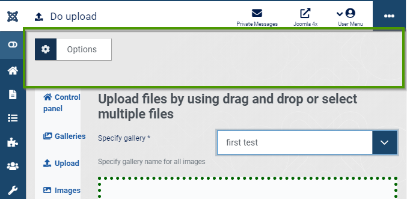
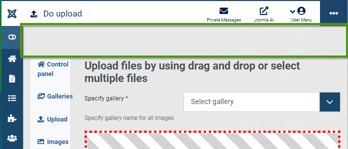
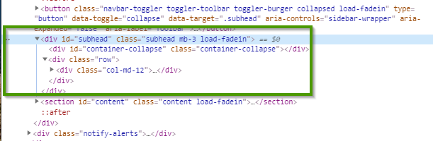
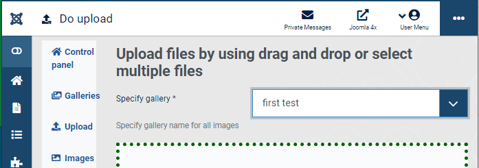

# Do not display "Option button" in toolbar
The option button or the complete toolbar may not be needed in on the component form



Following parts of the code needed to be dsiabled

```php
// Get the toolbar object instance
$toolbar = Toolbar::getInstance('toolbar');
$toolbar->preferences('com_rsgallery2');
```

Result see next section

# Avoid displaying not needed empty bar in component form

Whe no button is activated following empty space appears on the component form



There was no general switch in the joomla! 4 code (as far as i know 2020 february)
On stackoverflow is a article called ["How to hide grey 'button bar' in administrator component view"][dda6871d]

  [dda6871d]: https://joomla.stackexchange.com/questions/23802/how-to-hide-grey-button-bar-in-administrator-component-view "Hide grey 'button bar'"

Following the advice and adjusting it to joomla! 4 the sub header html part can be hidden. Following css is needed

```css
// Hack for removing empty header line
#subhead {
  height: 0px;
  min-height: 0px;
  padding: 0 0;
  visibility: hidden;
  margin: 0 0 !important;
}
```

This css applies to following joomla 4 html



## Result:
The grey  "button bar" is removed

